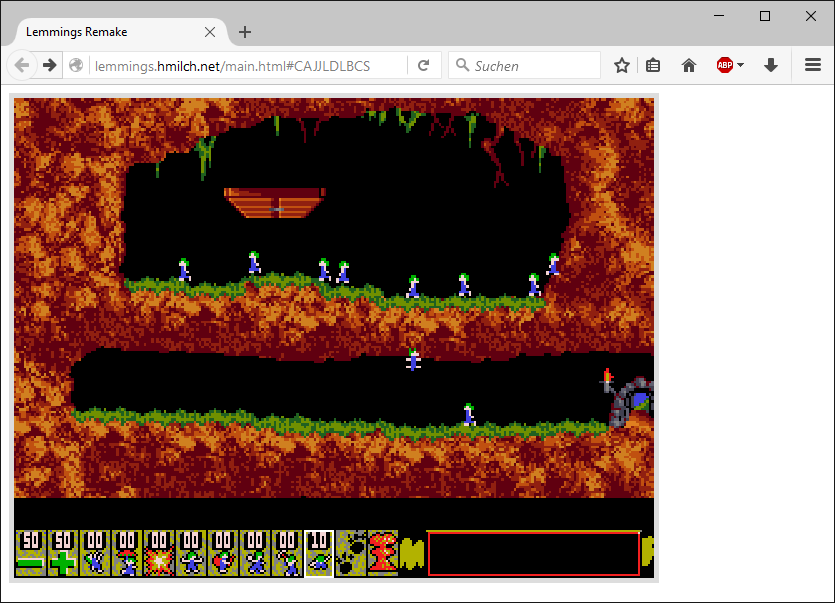
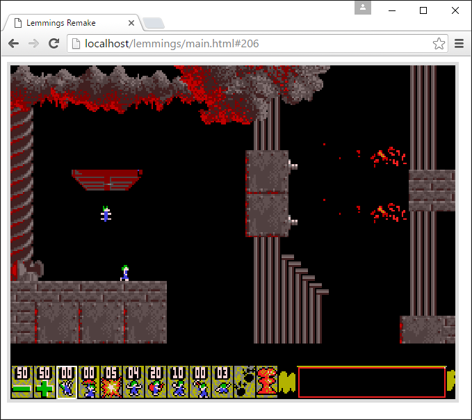
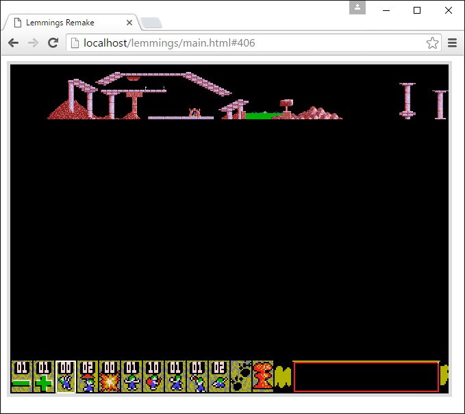

# Lemmings.js [legacy]

🎉 see the new Version [lemmings.ts](https://github.com/tomsoftware/lemmings.ts)

___

This is a [Lemmings](https://en.wikipedia.org/wiki/Lemmings_%28video_game%29) Clone/Remake using only HTML5 / Javascript. It uses the original .dat Files of the DOS game. No converting of Images and Levels is required.

<a href="http://lemmings.hmilch.net/">[play the game]</a>

This is a work in progress project and at the moment you can't play the game. Use the URL Fragment identifier (#) to select/load a Level e.g. [lemmings.js/main.html#10](http://lemmings.hmilch.net/release.html#10) for Level 10 or Levelcode e.g. [lemmings.js/main.html#CAJJLDLBCS](http://lemmings.hmilch.net/release.html#CAJJLDLBCS) for level 1.

Supported Versions: 
- Lemmings
- Oh No! More Lemmings
- Xmas Lemmings
- Holiday Lemmings

Disclaimer: This Project does not claim rights to any Lemmings Version. To the best of our/my knowledge, these titles have been discontinued by their publishers. If you know otherwise, please contact us/me and we will remove them accordingly. Thank you for your attention. See the LICENSE for mor information.
